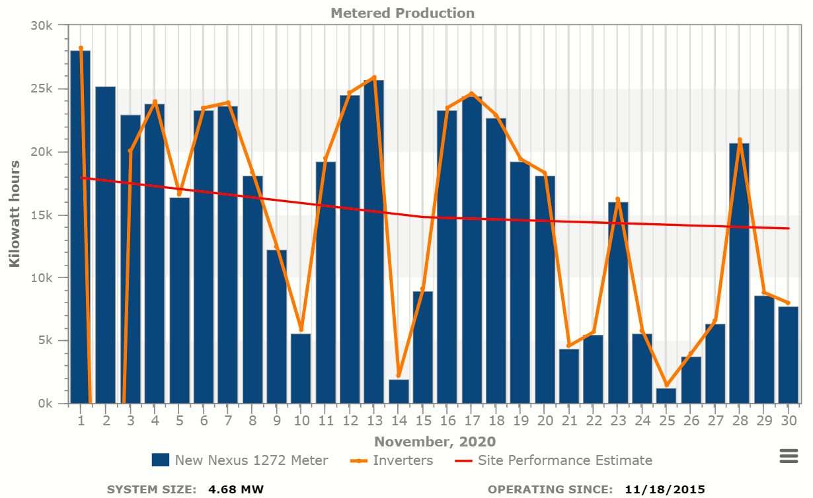
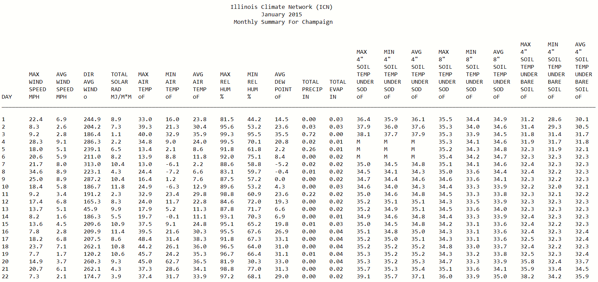
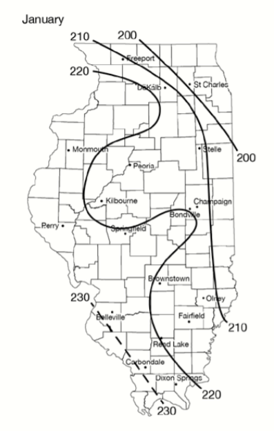
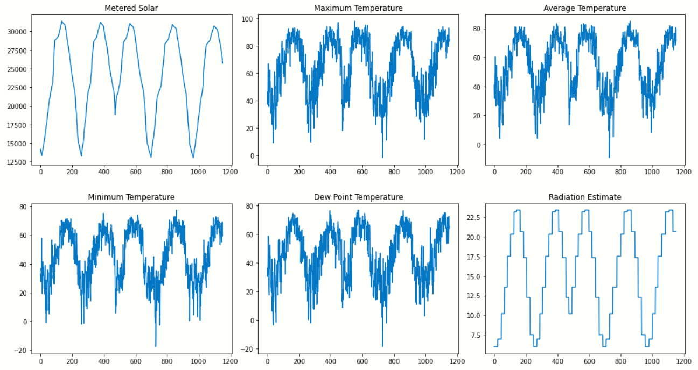

# 3. Data Collection and Analysis

This section will discuss the different types of data the group collected, cleaning said data, and the analyses performed on the datasets.

## 3.1 Raw Data Collection

**3.1.1 Solar Data**

**3.1.2 Daily Weather Observations**

**3.1.3 Monthly Solar Radiation**

## 3.2 Exploratory Analysis

This exploratory data analysis will compile weather and solar data into a single cohesive data frame and examine the data themselves to better understand the characteristics of the features and labels and better understand their relationship with each other. Towards these goals, we will use a variety of statistical methods and graphical and tabular representations to identify trends and relationships.

**3.2.1 Clean and compile weather data**

The weather data that was obtained was in a .txt format, which can be difficult to work with. In order to make this file a CSV to analyze with our other CSV files. First, the .txt file needed to be called into the kaggle workspace. Once we were able to read all the files in, we had to remove blank rows, metadata, and any column titles that were poorly formatted we renamed. Following these actions, we were able to take a closer look into the dataset. In order to properly match up columns, the “Unnamed: 0” column was renamed to date to fit in with our other dataset. Lastly, the dataset’s incomplete data frames were dropped, columns without proper names were renamed, and then the smaller data frames were compiled into a larger data frame and the index reset. This allowed us to see a cleaner view and understand what this dataset actually is portraying. Following this, it was clear that the weather and solar data should be combined in order to analyze and explore all aspects of the data.

**3.2.2 Clean and combine weather and soalr data**

In order to read these two CSV files, they needed to be merged on the date column. Upon further inspection, it was observed that some cells in the data frame had the character string “M” attached to the end of the number. This would construe data and our analysis so we removed the M with an empty character. Following this, the dropping of NaN cells had to be performed to make sure the dataset was as complete as possible. There were also columns that were in as an “object” type. This was converted to be a “float” type. Once the index was reset we were able to set up a dictionary of the average daily solar radiation for each month in champaign. This was the data gathers from the IL State Water Survey. One last final touch was to make sure we had no empty cells and that our data frame was organized by the date. Following these actions, we continued to the exploratory data analysis.

**3.2.3 Examine and visualize training data**

These measurements are all taken from historic weather observations, but when predicting solar output we will only be able to use features that we can predict a day ahead or use the previous day’s observed measurements to predict the next day's features. The goal of our examination is to view basic attributes of each column in the data frame, observe any seasonal changes, view the shape of each column distribution, and see what columns are most correlated. Once we find the most correlated we will compare those columns with the solar output.

*3.2.3.1 Observations*

From the basic statistics of the dataset, it was observed that there are large standard deviations for most columns. This is most likely due to the seasonal variation. 

Insert histograms here

From the observed histograms, one will notice the variance in distribution type. The most normally distributed histograms are wind direction (dir_wind) and minimum humidity (min_hum). The more logarithmic distributions are average wind (avg_wind), maximum humidity (max_hum), and total precipitation (tot_precip). One will also notice that certain distributions such as the soil temperature measurements favor extremes in their histograms.
Upon analysis of the correlation coefficients between each column in the dataset, it was observed that solar radiation is strongly correlated. This was expected, however, this cannot be predicted ahead of time. Additionally, there was a strong correlation between temperatures and the dew point, both commonly used to predict weather forecasts. Below in figure one will see the time series graphs for the most correlated variables.

From the time-series graphs, one can observe the seasonal variability in the graphs. The seasonal trends are apparent, yet not perfect. There is still quite a bit of noise in these observations. The next thing to look at will be the scatter plots of the 4 most correlated features with solar output. Once this is completed a regression analysis will be run to see how each feature affects the variation in solar output.

insert correlation graphs here

The results of the linear regressions of these plots were quite interesting. It was observed that the average daily solar radiation in Champaign explains about 93% of the variation in solar output, maximum daily temperature explains 54%, minimum daily temperature explains 53%, average daily temperature explains 56%, and dew temperature explains 45%. Although these values are all around 50% the goal is to use all of them and increase the predictive value as a whole.

**3.2.4 Key take-aways**

The Illinois State Water Survey's estimate of daily solar output in Champaign is a very good predictor of solar output, daily temperature indicators and dew point are also good indicators of solar output and can be predicted ahead of time. These features will be useful in model development. Day-ahead predictions of radiation and evaporation are not easily obtainable, realistically it would be difficult to use these to develop day-ahead prediction of solar output.  Features that are commonly included in weather predictions (temperature and humidity) may be suitable predictors of solar output.  Correlation between solar output and minimum humidity is positive and a linear regression fits the data with an R-squared of 0.62. Maximum daily temperature is positively correlated with solar output and when a linear regression model is developed, that model accounts for approximately 33% of variation in the data. The correlation between average daily temperature and solar output is weaker but still positive. The model created for this project will utilize five features: radiation estimation (rad_est), average temperature (avg_temp), dew point (dew), minimum temperature (min_temp), and maximum temperature (max_temp). From the EDA these seem to be the most promising at achieving an accurate prediction model.
