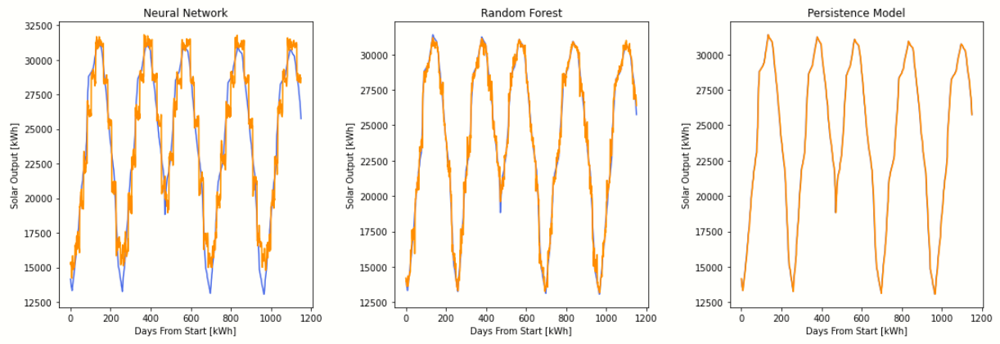

# 5. Results 

In order to compare our models we developed two figures to observe. The first being a graph of our predicted results and the actual results. This graph displays the overlap of the data and how accurate our model was at predicting the correct values. 

Between the two models we developed, the random forest regression produced a more accurate graph. The underlying blue is the true solar output and the orange more noisy line is the prediction the model produced. For the most part, the two lines follow the same path, which is a good sign. The prediction doesn't do as well with the extreme values which may be due to overfitting in the neural network or biase in the learning algorithm. In the random tree regression the extreme values are a bit more accurate, but at the very tip are still off. The persistence model performs more strongly than either of our algorithms.
The next graph type we looked at was the correlation between our actual data and the model's predicted data.

A perfectly correlated relationship between the independent and depent variable would be a straight line with a slope of 1. Both of our models produced a linearly increasing line, which shows correlation. The graph for random forest is much tighter than the neural network, this is because our random forest regression is more accurate.  
Further inspection of the data allows us to compare the root means squared, mean absolute error, and the R-squared values for each model.

| Model Type | RMSE | MAE | R-squared | Correlation Coefficient|
| :---: | :---: | :---: | :---: | :---: |
| Neural Network | 1486 | 1557 | 0.93 | 0.967 | 
| Random Forest | 824 | 634 | 0.97 | 0.999 |
| Persistence Model | 184 | 135 | 0.99| 0.996 |

Between the two models we developed the random forest regression out performs the neural network.  It is noted that the mean absolute error and root mean squared error are both lower than the neural network results. This is the first indication that the model is out performing the neural network. The R-squared value is quite high at 0.97. This means that the predicted values of the model explain about 97% of the variation in the underlying data. A high r-squared value indicates that the model values fit the actual values very well, a result one hopes for when predicting future values. Obviously, the more correlated the actual values are to the predicted values the more accurate the model is. However, one cannot only rely on correlation graphs because as seen in the neural network the correlation was still high even though the r-squared was 0.93. 
