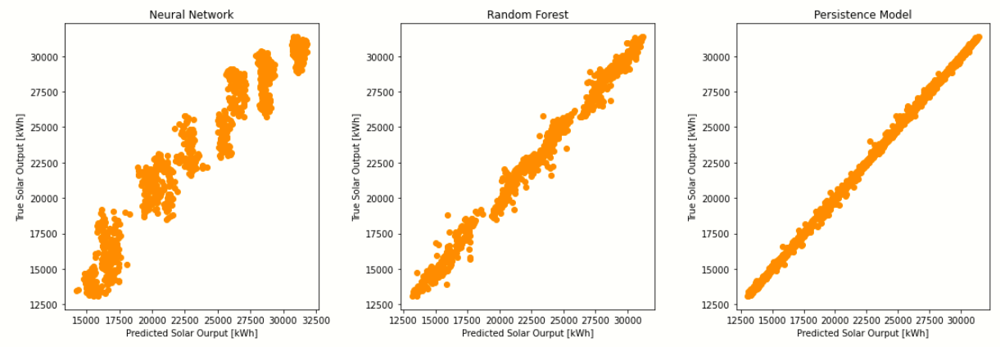

---
author-meta:
- Kylie Burkett
- Allisa Hastie
bibliography:
- content/manual-references.json
date-meta: '2020-12-07'
header-includes: '<!--

  Manubot generated metadata rendered from header-includes-template.html.

  Suggest improvements at https://github.com/manubot/manubot/blob/master/manubot/process/header-includes-template.html

  -->

  <meta name="dc.format" content="text/html" />

  <meta name="dc.title" content="Machine Learning: Solar Energy Output" />

  <meta name="citation_title" content="Machine Learning: Solar Energy Output" />

  <meta property="og:title" content="Machine Learning: Solar Energy Output" />

  <meta property="twitter:title" content="Machine Learning: Solar Energy Output" />

  <meta name="dc.date" content="2020-12-07" />

  <meta name="citation_publication_date" content="2020-12-07" />

  <meta name="dc.language" content="en-US" />

  <meta name="citation_language" content="en-US" />

  <meta name="dc.relation.ispartof" content="Manubot" />

  <meta name="dc.publisher" content="Manubot" />

  <meta name="citation_journal_title" content="Manubot" />

  <meta name="citation_technical_report_institution" content="Manubot" />

  <meta name="citation_author" content="Kylie Burkett" />

  <meta name="citation_author_institution" content="Department of Civil &amp; Environmental Engineering" />

  <meta name="citation_author_institution" content="University of Illinois at Urbana-Champaign" />

  <meta name="twitter:creator" content="@burkett_kylie" />

  <meta name="citation_author" content="Allisa Hastie" />

  <meta name="citation_author_institution" content="Department of Civil &amp; Environmental Engineering" />

  <meta name="citation_author_institution" content="University of Illinois at Urbana-Champaign" />

  <meta name="twitter:creator" content="@AllisaG_Hastie" />

  <link rel="canonical" href="https://Kylierb2.github.io/SolarEnergy/" />

  <meta property="og:url" content="https://Kylierb2.github.io/SolarEnergy/" />

  <meta property="twitter:url" content="https://Kylierb2.github.io/SolarEnergy/" />

  <meta name="citation_fulltext_html_url" content="https://Kylierb2.github.io/SolarEnergy/" />

  <meta name="citation_pdf_url" content="https://Kylierb2.github.io/SolarEnergy/manuscript.pdf" />

  <link rel="alternate" type="application/pdf" href="https://Kylierb2.github.io/SolarEnergy/manuscript.pdf" />

  <link rel="alternate" type="text/html" href="https://Kylierb2.github.io/SolarEnergy/v/efd51615c2517e73be6e40872232209e180a1c5e/" />

  <meta name="manubot_html_url_versioned" content="https://Kylierb2.github.io/SolarEnergy/v/efd51615c2517e73be6e40872232209e180a1c5e/" />

  <meta name="manubot_pdf_url_versioned" content="https://Kylierb2.github.io/SolarEnergy/v/efd51615c2517e73be6e40872232209e180a1c5e/manuscript.pdf" />

  <meta property="og:type" content="article" />

  <meta property="twitter:card" content="summary_large_image" />

  <link rel="icon" type="image/png" sizes="192x192" href="https://manubot.org/favicon-192x192.png" />

  <link rel="mask-icon" href="https://manubot.org/safari-pinned-tab.svg" color="#ad1457" />

  <meta name="theme-color" content="#ad1457" />

  <!-- end Manubot generated metadata -->'
keywords:
- markdown
- publishing
- manubot
lang: en-US
manubot-clear-requests-cache: false
manubot-output-bibliography: output/references.json
manubot-output-citekeys: output/citations.tsv
manubot-requests-cache-path: ci/cache/requests-cache
title: 'Machine Learning: Solar Energy Output'
...


<small><em>
This manuscript
([permalink](https://Kylierb2.github.io/SolarEnergy/v/efd51615c2517e73be6e40872232209e180a1c5e/))
was automatically generated
from [Kylierb2/SolarEnergy@efd5161](https://github.com/Kylierb2/SolarEnergy/tree/efd51615c2517e73be6e40872232209e180a1c5e)
on December 7, 2020.
</em></small>

## Authors


+ **Kylie Burkett**<br>
    · {.inline_icon}
    [Kylierb2](https://github.com/Kylierb2)
    · {.inline_icon}
    [burkett_kylie](https://twitter.com/burkett_kylie)<br>
  <small>
     Department of Civil & Environmental Engineering; University of Illinois at Urbana-Champaign
  </small>

+ **Allisa Hastie**<br>
    · {.inline_icon}
    [ahastie2](https://github.com/ahastie2)
    · {.inline_icon}
    [AllisaG_Hastie](https://twitter.com/AllisaG_Hastie)<br>
  <small>
     Department of Civil & Environmental Engineering; University of Illinois at Urbana-Champaign
  </small>


# Abstract {.page_break_before}

The world around us is ever-changing and in order to keep our planet clean and habitable researchers are always trying to find new ways of producing renewable energy. Renewable energy is a key part of reducing emissions and impacting the environment positively. Solar generation is a type of renewable energy that this project will explore. More specifically, how do we predict how much solar energy we have available? In order to do this our project will explore the different datasets available that pertain to solar energy. We will explore the effects these features have on solar energy and if we can predict them. To predict the energy output of solar panels we will use machine learning techniques such as artificial neural networks and random tree regression models. The solar farm we will be observing is on the campus of the University of Illinois at Urbana-Champaign. Utilizing the machine learning techniques we learned in class we find that random tree regression models perform the best when it comes to predicting solar energy outputs. Our models were compared using a persistence model along with correlation and R-squared models. Further research on the topic will lead to more accurate results and enhance the ability of energy plants to increase energy efficiency.

{width="6in"}


# 1. Introduction {.page_break_before}
Solar generation is an up and coming alternative energy resource. On the campus of the University of Illinois at Urbana-Champaign researchers have created solar farms to try and reduce the University’s carbon dioxide emissions. Solar farm 1.0 is the first UIUC solar farm; it has been operational since December of 2015. It is 20.8 acres of land and produces around 7,200 megawatt-hours of electricity annually. Surprisingly, this is only about 2% of the total megawatt-hours the university requires annually. In order to produce more the university recently published its plans to start work on “Solar Farm 2.0”. Solar farm 2.0 will be around 54 acres and produce as much as 20 thousand megawatt-hours annually; approximately 6% of university demand annually. Solar generation is important to “balancing the grid” and the more one is able to predict this output the more efficient energy usage will be. Knowing when solar energy will “run out” is largely a part of being able to utilize the maximum amount of solar energy generation. The goal of this project is to use machine learning techniques learned in class and publicly available data in order to predict the daily energy output from the UIUC solar farms.


# 2. Literature Review 

In order to better understand the current research on predicting solar generation, a literature review was conducted. Our goal in performing this review is to gain a more comprehensive understanding of modern techniques in machine learning particularly as it pertains to our application. We chose to exmine two papers, the first is a review paper that covers this field of study in general, the second examines work done by a specific team to predict solar output from publically available weather forecasts.

## 2.1 Machine learning methods for solar radiation forecasting: A Review - Cyril Voyant Et Al.

The journal paper explores other journals that have conducted research on predicting solar generation. This mass review found that most people who are doing research on solar generation are using artificial neural networks in order to predict outputs. This method is effective, however, the authors found that regression tree methods are actually performing with better results. Using his information the model for this project will use both neural networks and regression trees to see how they perform against each other. 

## 2.2 Predicting Solar Generation from Weather Forecasts Using Machine Learning - Sharma, N.; Sharma, P.; Irwin, D.; and Shenoy, P

The next journal was a case study from a research group using national weather forecast data.  The biggest issue they found was uncontrollable variability in weather patterns. This is expected in this type of research because the weather is a natural phenomenon that one can only predict toa certain extent. This group exclusively used support vector machines to resample the datasets. Support vector machines take in a large amount of data and then resample them into different smaller datasets in order to easily compare and analyze them. The most interesting aspect of this research was the use of datasets although they did not correlate well with test data.  This is something that the group will keep in mind when making their own models.


# 3. Data Collection and Analysis

This section will discuss the different types of data the group collected, cleaning said data, and the analyses performed on the datasets.

## 3.1 Raw Data Collection

**3.1.1 Solar Data**

{width="5.5in"}

Solar data will be important to test our model with, these are actual values from the UIUC dashboard.


**3.1.2 Daily Weather Observations**


Daily weather data will allow us to utilize other features such as temperature, dew point, and humidity.


**3.1.3 Monthly Solar Radiation**

{width="2in"}

Monthly solar radition will allow us to look at the estimation of solar radiation for Champaign.

## 3.2 Exploratory Analysis

This exploratory data analysis will compile weather and solar data into a single cohesive data frame and examine the data themselves to better understand the characteristics of the features and labels and better understand their relationship with each other. Towards these goals, we will use a variety of statistical methods and graphical and tabular representations to identify trends and relationships.

**3.2.1 Clean and compile weather data**

The weather data that was obtained was in a .txt format, which can be difficult to work with. In order to make this file a CSV to analyze with our other CSV files. First, the .txt file needed to be called into the kaggle workspace. Once we were able to read all the files in, we had to remove blank rows, metadata, and any column titles that were poorly formatted we renamed. Following these actions, we were able to take a closer look into the dataset. In order to properly match up columns, the “Unnamed: 0” column was renamed to date to fit in with our other dataset. Lastly, the dataset’s incomplete data frames were dropped, columns without proper names were renamed, and then the smaller data frames were compiled into a larger data frame and the index reset. This allowed us to see a cleaner view and understand what this dataset actually is portraying. Following this, it was clear that the weather and solar data should be combined in order to analyze and explore all aspects of the data.

**3.2.2 Clean and combine weather and soalr data**

In order to read these two CSV files, they needed to be merged on the date column. Upon further inspection, it was observed that some cells in the data frame had the character string “M” attached to the end of the number. This would construe data and our analysis so we removed the M with an empty character. Following this, the dropping of NaN cells had to be performed to make sure the dataset was as complete as possible. There were also columns that were in as an “object” type. This was converted to be a “float” type. Once the index was reset we were able to set up a dictionary of the average daily solar radiation for each month in champaign. This was the data gathers from the IL State Water Survey. One last final touch was to make sure we had no empty cells and that our data frame was organized by the date. Following these actions, we continued to the exploratory data analysis.

**3.2.3 Examine and visualize training data**

These measurements are all taken from historic weather observations, but when predicting solar output we will only be able to use features that we can predict a day ahead or use the previous day’s observed measurements to predict the next day's features. The goal of our examination is to view basic attributes of each column in the data frame, observe any seasonal changes, view the shape of each column distribution, and see what columns are most correlated. Once we find the most correlated we will compare those columns with the solar output.

*3.2.3.1 Observations*

From the basic statistics of the dataset, it was observed that there are large standard deviations for most columns. This is most likely due to the seasonal variation. 

{width="4in"}

From the observed histograms, one will notice the variance in distribution type. The most normally distributed histograms are wind direction (dir_wind) and minimum humidity (min_hum). The more logarithmic distributions are average wind (avg_wind), maximum humidity (max_hum), and total precipitation (tot_precip). One will also notice that certain distributions such as the soil temperature measurements favor extremes in their histograms.
Upon analysis of the correlation coefficients between each column in the dataset, it was observed that solar radiation is strongly correlated. This was expected, however, this cannot be predicted ahead of time. Additionally, there was a strong correlation between temperatures and the dew point, both commonly used to predict weather forecasts. Below in figure one will see the time series graphs for the most correlated variables.


From the time-series graphs, one can observe the seasonal variability in the graphs. The seasonal trends are apparent, yet not perfect. There is still quite a bit of noise in these observations. The next thing to look at will be the scatter plots of the 4 most correlated features with solar output. Once this is completed a regression analysis will be run to see how each feature affects the variation in solar output.


The results of the linear regressions of these plots were quite interesting. It was observed that the average daily solar radiation in Champaign explains about 93% of the variation in solar output, maximum daily temperature explains 54%, minimum daily temperature explains 53%, average daily temperature explains 56%, and dew temperature explains 45%. Although these values are all around 50% the goal is to use all of them and increase the predictive value as a whole.

**3.2.4 Key take-aways**

The Illinois State Water Survey's estimate of daily solar output in Champaign is a very good predictor of solar output, daily temperature indicators and dew point are also good indicators of solar output and can be predicted ahead of time. These features will be useful in model development. Day-ahead predictions of radiation and evaporation are not easily obtainable, realistically it would be difficult to use these to develop day-ahead prediction of solar output.  Features that are commonly included in weather predictions (temperature and humidity) may be suitable predictors of solar output.  Correlation between solar output and minimum humidity is positive and a linear regression fits the data with an R-squared of 0.62. Maximum daily temperature is positively correlated with solar output and when a linear regression model is developed, that model accounts for approximately 33% of variation in the data. The correlation between average daily temperature and solar output is weaker but still positive. The model created for this project will utilize five features: radiation estimation (rad_est), average temperature (avg_temp), dew point (dew), minimum temperature (min_temp), and maximum temperature (max_temp). From the EDA these seem to be the most promising at achieving an accurate prediction model.


# 4. Model Development

In order to predict daily solar output, two different models will be used: neural network and random forest regression. In order to assess the accuracy of the model, a persistence model will be used for comparison. The means squared error, R-squared, and correlation will determine which model performs best.


## 4.1 Neural Network

```
x=training_data[["rad_est", "avg_temp", "dew", "min_temp", "max_temp"]]
y=np.ravel(training_data["Site Performance Estimate"])
scaler=MinMaxScaler()
x=scaler.fit_transform(x)

train_ds=tf.data.Dataset.from_tensor_slices((x, y)).batch(batch_size=150)
epochs=500

model=tf.keras.Sequential() 

model.add(tf.keras.layers.Dropout(0.2))

model.add(tf.keras.layers.Dense(units=128, input_shape=(5,)))

model.add(tf.keras.layers.Dense(units=256, activation="relu"))

model.add(tf.keras.layers.Dense(units=256, activation="relu"))

model.add(tf.keras.layers.Dense(1))

model.compile(optimizer=tf.keras.optimizers.Adam(learning_rate=0.01, decay=0.01/epochs), loss="mse" )


history=model.fit(train_ds.shuffle(10), epochs=epochs) 
```

This neural network will utilize five features from the training dataset: radiation estimation (rad_est), average temperature (avg_temp), dew point (dew), minimum temperature (min_temp), and maximum temperature (max_temp). The hidden layers of this network are made up of 256 nodes each and both use the Rectified Linear Unit activation (relu). This is a common activation function in neural networks because it avoids the vanishing gradient problem that may occur with other activations. We also include a dropout layer to avoid overfitting the training data. This dropout layer randomly sets node weights to 0 at a rate of 0.2 for each step in the learning process.

## 4.2 Random Forest Regression

```
x = df_train[["rad_est", "avg_temp",  "dew", "min_temp", "max_temp"]]
y = np.ravel(df_train["Site Performance Estimate"])

scaler=MinMaxScaler()
x = scaler.fit_transform(x)


train_x, test_x, train_y, test_y = train_test_split(x, y, test_size =.2, random_state = 42)

regr = RandomForestRegressor(n_estimators = 5000, 
                             criterion= 'mse', 
                             max_depth=100, 
                             random_state=0,
                             min_samples_split = 2,
                             min_samples_leaf=1, 
                             max_features = 'auto',
                            bootstrap = True)

regr.fit(train_x, train_y)
```

The second model that was developed is the random forest regression model. This model is interesting because unlike a neural network it takes the datasets and creates multiple decision trees in order to find the best-fit prediction. Random forest models are less likely to overfit because of this. For this project, the same features will be used in order to compare the two models more accurately. These features are as follows: radiation estimation (rad_est), average temperature (avg_temp), dew point (dew), minimum temperature (min_temp), and maximum temperature (max_temp). An interesting hyperparameter that was used is the “bootstrap” function. Bootstrapping is a way of resampling. This model implemented bootstrap = True which will use subsets of the data to form decision trees. If bootstrap = false was utilized then the entire dataset would have been used to form trees. Interestingly, better results were obtained using “True” over “False” which is seldom the case in literature reviews.


# 5. Results 

In order to compare our models we developed two figures to observe. The first being a graph of our predicted results and the actual results. This graph displays the overlap of the data and how accurate our model was at predicting the correct values. 


Between the two models we developed, the random forest regression produced a more accurate graph. The underlying blue is the true solar output and the orange more noisy line is the prediction the model produced. For the most part, the two lines follow the same path, which is a good sign. The prediction doesn't do as well with the extreme values which may be due to overfitting in the neural network or biase in the learning algorithm. In the random tree regression the extreme values are a bit more accurate, but at the very tip are still off. The persistence model performs more strongly than either of our algorithms.
The next graph type we looked at was the correlation between our actual data and the model's predicted data.




A perfectly correlated relationship between the independent and depent variable would be a straight line with a slope of 1. Both of our models produced a linearly increasing line, which shows correlation. The graph for random forest is much tighter than the neural network, this is because our random forest regression is more accurate.  
Further inspection of the data allows us to compare the root means squared, mean absolute error, and the R-squared values for each model.


| Model Type | RMSE | MAE | R-squared | Correlation Coefficient|
| :---: | :---: | :---: | :---: | :---: |
| Neural Network | 1486 | 1557 | 0.93 | 0.967 | 
| Random Forest | 824 | 634 | 0.97 | 0.999 |
| Persistence Model | 184 | 135 | 0.99| 0.996 |


Between the two models we developed the random forest regression out performs the neural network.  It is noted that the mean absolute error and root mean squared error are both lower than the neural network results. This is the first indication that the model is out performing the neural network. The R-squared value is quite high at 0.97. This means that the predicted values of the model explain about 97% of the variation in the underlying data. A high r-squared value indicates that the model values fit the actual values very well, a result one hopes for when predicting future values. Obviously, the more correlated the actual values are to the predicted values the more accurate the model is. However, one cannot only rely on correlation graphs because as seen in the neural network the correlation was still high even though the r-squared was 0.93. 


# 6. Conclusion

The ability to predict solar output will be very important in the future due to the growing use of alternative energy sources. This project aimed to find an accurate and reliable way to predict this output. The results proved that using a random forest regression model may be the best choice. While many groups seem to be utilizing neural networks it may be time for them to switch over to random tree regressions. The findings from this project were that random forest regression out performs neural networks in the realm of solar energy output predictions. Due to the complexity of random forest and the ability to avoid overfitting, this model seems to be promising.

Although the model was fairly accurate there are still some changes we would make for future research. First off, hourly weather prediction datasets would allow us to predict hourly solar radiation outputs. This would lead us to be able to balance the grid more accurately and result in optimal energy use. Current operators have to determine when to shut off solar energy and switch back to conventional energy sources. If they have a more accurate prediction of when solar generation will “run out” then one could optimize the energy used. Next, in order to improve our model we would like to use a cloud cover database and solar radiation estimates. The cloud database would improve our models because you can get a better idea of how much total radiation is actually being caught on the solar panels. If there is too much cloud coverage then one will observe less radiation and more radiation if there is less cloud coverage. Having actual numbers for solar radiation estimates would be effective in improving the model, however this task is very time consuming and difficult to produce. One would need to utilize large equations such as the Penman Monteith equation. Lastly, we would want to spend more time tuning the hyperparameters for the random tree regression model. This would involve setting up the code to view ranges of hyperparameters instead of just one singular variable. The goal of tuning hyperparameters is that we could get the parameter as close to the optimal one as possible, resulting in a more accurate model.

With the ever growing need for alternative energy sources, the ability to predict renewable energy output such as solar will be vital to the future of energy efficiency and production. This project aimed to utilize public data and machine learning techniques to predict the solar output of the UIUC solar farm. With high r-squared values and high correlation to actual values our model has great potential. With future research and fine tuning we expect our model to be more accurate and successful at predicting solar energy outputs.


## References {.page_break_before}

<!-- Explicitly insert bibliography here -->
<div id="refs"></div>
